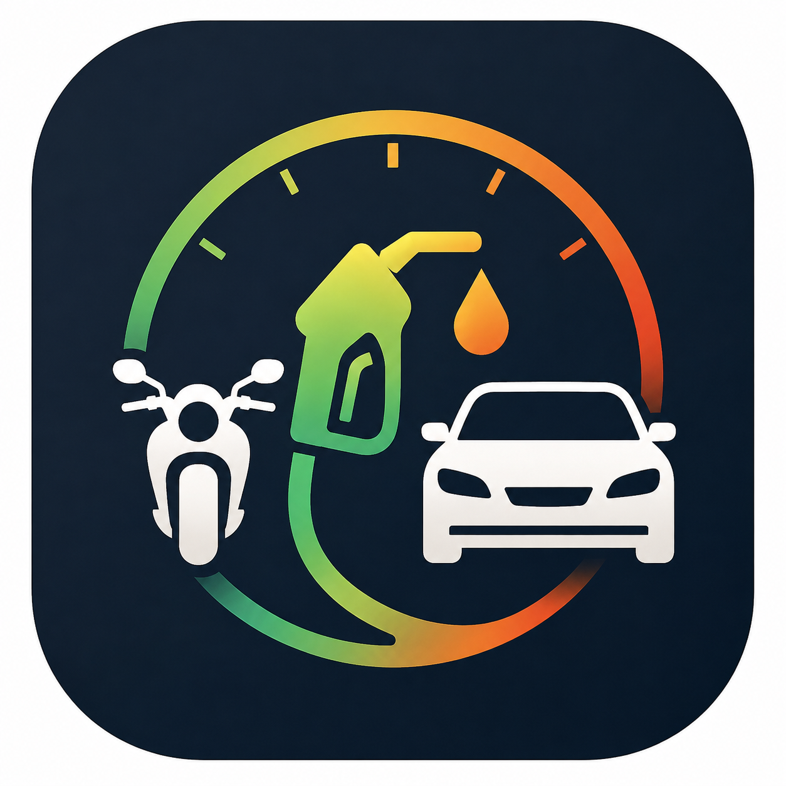

#  Fuel Tracker

A modern Android application to track fuel efficiency and costs for multiple vehicles.

## 🚀 Working Principles

The Fuel Tracker app is designed with accuracy and multi-vehicle management at its core:

### 1. Accurate Mileage Calculation
Unlike many trackers that use the current fuel entry for mileage, this app uses the **Previous Fill-Up** method:
- **Calculation**: When you enter your current odometer reading, the app calculates the distance since the last refill. It then divides this distance by the fuel amount added during the **previous** refill.
- **Why?**: The fuel you just "poured" in will be used for the *next* trip. The fuel that was consumed to cover the distance you just traveled was what you filled *last time*.
- **Formula**: `Mileage = (Current Odometer - Previous Odometer) / Previous Fuel Quantity`

### 2. Multi-Vehicle Management
- **Landing Page**: Choose which vehicle you want to track from a grid-based selection screen.
- **Separate Contexts**: Each vehicle has its own independent history, statistics, and average mileage calculations.
- **Management**: Add, edit, or delete vehicles from the settings menu. Deleting a vehicle safely prompts for confirmation and clears associated logs.

### 3. Data & Insights
- **Dashboard**: Real-time average mileage and quick-view of the latest refill.
- **Statistics**: Visual trends for mileage and spending using interactive charts.
- **Backup & Restore**: Export your data to a JSON file for safe keeping or migration.

### 4. User Experience
- Built with **Jetpack Compose** and **Material 3**.
- **Edit/Delete Safety**: Confirmation dialogs for all destructive actions.
- **Quick Entry**: Add fuel refills with automatic price-per-liter and distance calculations.

## 📥 Download App

You can download the latest version of the app by clicking the button below:

---
*Built with ❤️ for Indian Vehicle Owners.*
